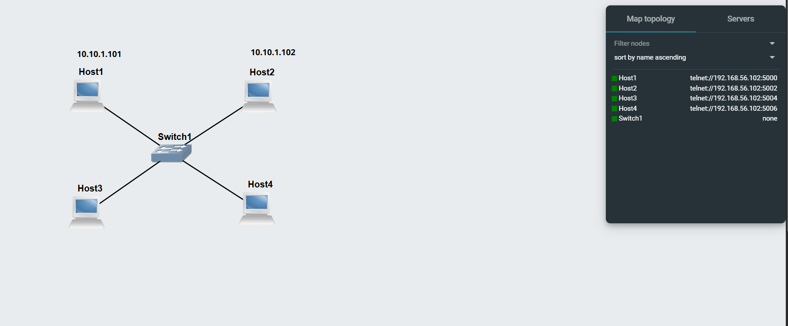
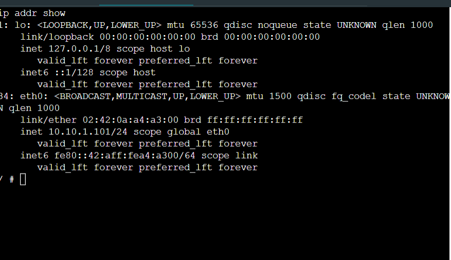
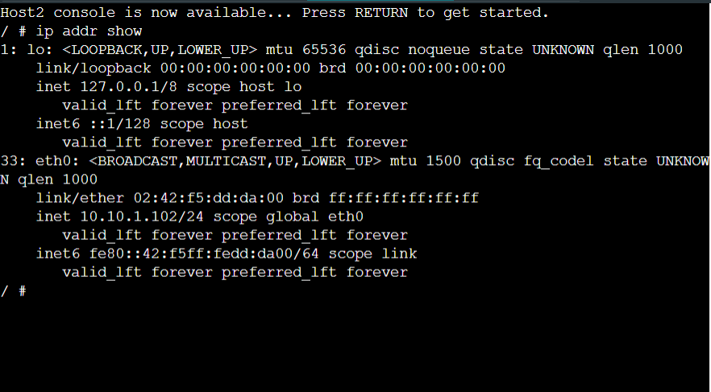
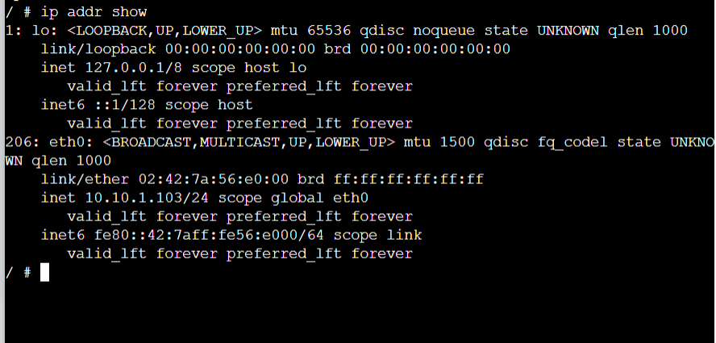
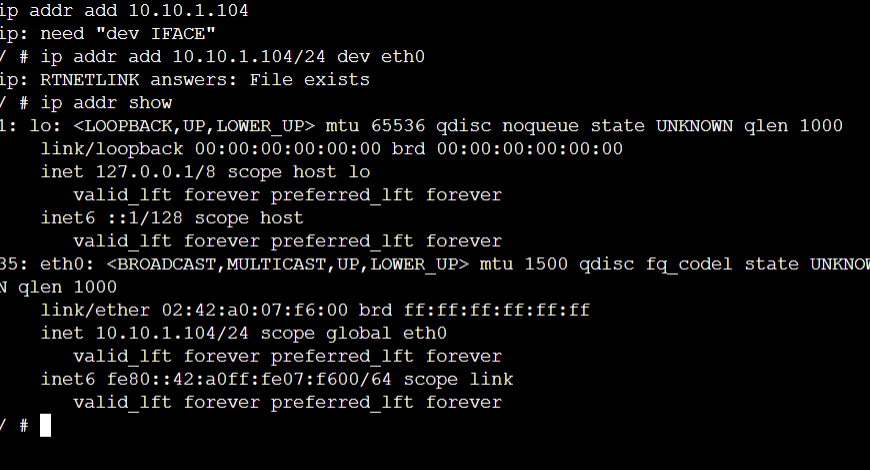
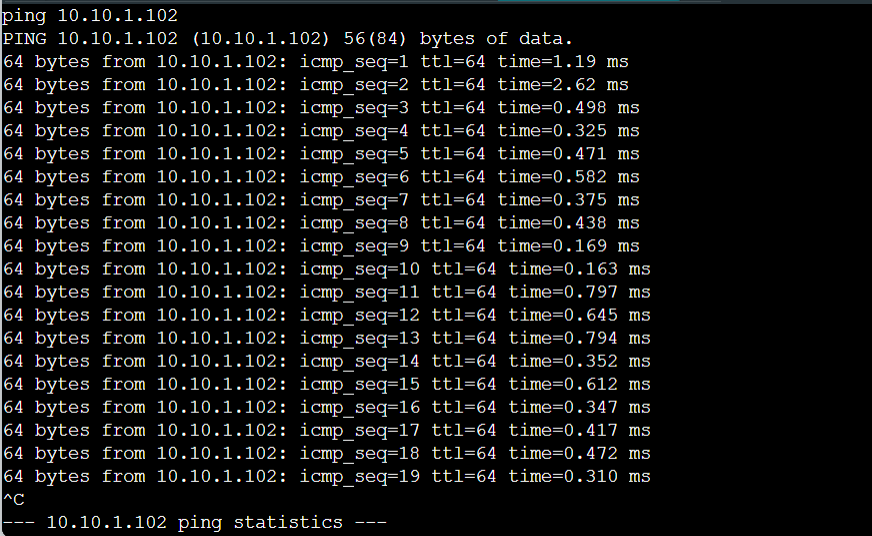

# COIT20261 – Week 02 Portfolio
 Name: Ayushiben Patel
 
 Student ID: 12312209

 Unit Name: Network Services and Automation
 
 Unit code: COIT20261 

##  1. Overview
In Week 2, I learned how to set static IP addresses on Linux in different ways. I also learned how to check if devices can talk to each other by using the ping command. This week was very hands‑on and helped me understand how devices communicate in a network.

##  2. Task 1 – Setting Static IP Addresses

### Aim 
The aim was to learn three different ways to set static IP addresses on Linux hosts.

###  Steps Performed

1. Created a project named:  
   Setting-IP-12312209

2. Added:
   - 4 Linux Hosts  
   - 1 Ethernet Switch  

3. Connected all devices into a LAN  

4. Selected network:  
   10.10.1.101/24
   
### IP Configuration Methods
####  Using Host A, B, C and D Configure Menu 
       auto eth0
      iface eth0 inet static
         address 10.10.1.101
         netmask 255.255.255.0
         
### Checked all IP addresses using this command

ip address show

##  Screenshots
- Network topology

  
- Host 1 IP output

- Host 2 IP output
 

- Host 3 IP output
  
  
- Host 4 IP output
   

  ##  Testing Results
- All hosts successfully received IP addresses  
- All devices were connected in same network  
- No errors in configuration  

##  3. Task 2 – Testing Connectivity with Ping

###  Aim
  To check if the network is working and see the delay, I used the ping command.

###  Steps Performed

####  Normal Ping
From Host A to Host B:
ping 10.10.1.102
Observed:
- I got replies successfully
- RTT time was shown.

####  Ping to Wrong IP
  Observed:
- No replies
- All packets were lost.

 #### Ping with Options
  Observed:
- Limited number of packets   
- Data size changed  

## Screenshots

- Ping normal output

- Ping wrong IP

   
- Ping with options
 

 

